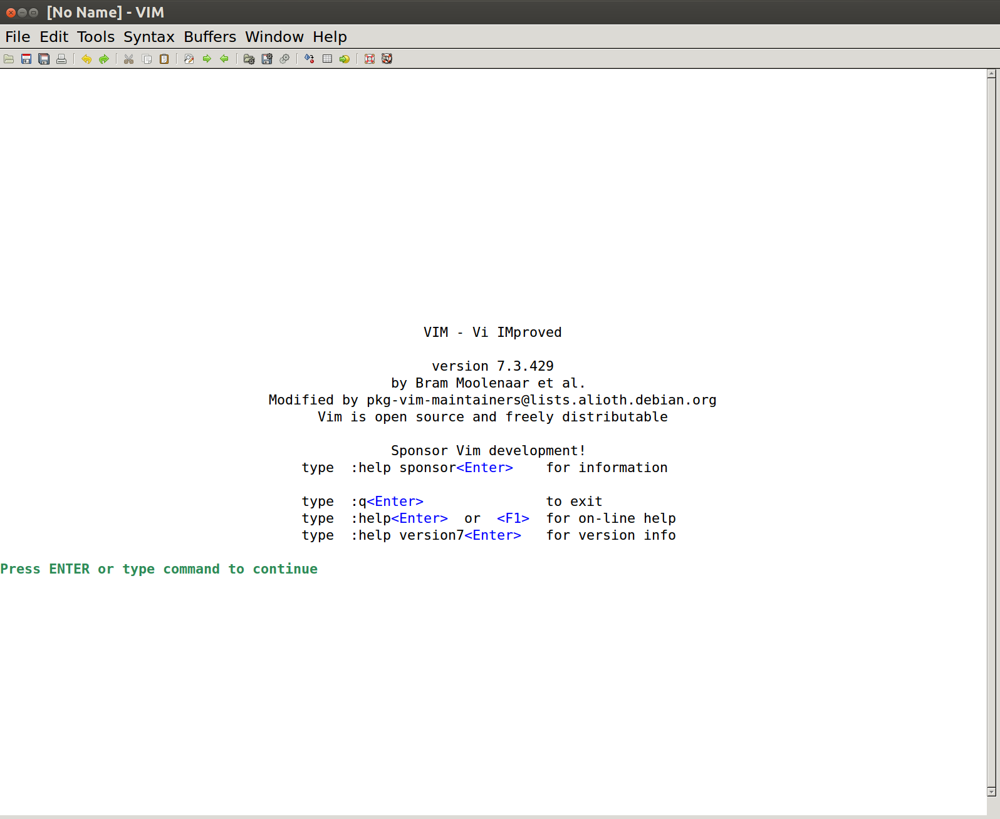

# 全国高校云计算应用创新大赛------AntOS产品介绍

在本文中我们将对AntOS进行一个介绍。说明AntOS的优势、总体框架和模块设计、功能点以及已有成果。

## 1、AntOS的简介

本作品AntOS是一个云操作系统。与ChromeOS类似，在AntOS中软件可以部署在云端，用户可以在廉价的设备上运行起一个桌面级的操作系统。

AntOS采用经典的C/S架构，服务端负责管理服务器集群资源管理、用户信息维护、Docker容器调度执行以及容错灾备，客户端则提供了清爽的用户界面。服务端采用Docker容器避免了传统虚拟机方案的高开销，又达到了一定的安全隔离性，且Docker镜像一步收敛的部署方式有助于降低用户的心智负担。客户端采用极简设计，由Qt管理程序提供唯一的图形界面，大幅降低了对客户机的硬件要求。服务端与客户端除通过HTTP进行控制通信外，应用程序图形界面的绘制直接采用了X11绘制指令，降低了带宽压力；为保证安全，图形界面通信均通过SSH加密。

AntOS系统采用瘦客户端+直接X11绘图+高密度Docker容器的方案，有助于提供流畅的用户体验，且硬件要求低，适用于低成本的私有云环境。

## 2、AntOS的优势与特色

目前市场上比较流行的云操作系统是ChromeOS与SUNDE，他们代表了云操作系统不同的技术路径，是AntOS的两类竞品。AntOS相比ChromeOS与SUNDE这两类竞品都有不同的优势：**更完整的功能性**、**更丰富的软件源**、**更低的带宽负载**、**更小的服务器开销**。

### 2.1、AntOS与ChromeOS相比的优势

ChromeOS是一种基于浏览器的云操作系统。

1、**AntOS可以直接将传统操作系统的软件部署在服务器端，相比ChromeOS功能性更强。**ChomeOS整个操作系统基于浏览器而存在，所有的应用都是一个Web网站，在软件的功能性上就会有所不足。AntOS的软件来源于Linux，软件的来源相比ChromeOS会更加充足。

2、**AntOS相比ChromeOS拥有更多的软件源**。ChromeOS的软件是Web应用，软件的结构以及开发环境和传统操作系统的开发环境完全不同，开发者要为ChromeOS重新开发软件，比较麻烦。AntOS可以很好的运行Linux软件以及Windows软件（借助Wine的帮助）。

以上两点都可以证明AntOS相比ChromeOS更充足的软件源和更丰富的功能性。

### 2.2、AntOS相比SUNDE相比的优势

SUNDE是一类基于虚拟机和VNC的云操作系统硬软件的解决方案。它使用虚拟机来划分服务器端的存储和计算资源，使用VNC来进行远程控制。AntOS相比SUNDE这类解决方案有两点做得更好。

1、**相比虚拟机，AntOS使用Docker来划分后台资源，可以降低开销、增加启动速度、增加响应速度、增强用户体验。**因为Docker相比虚拟机是没有额外开销的，是不需要运行额外系统内核的，所以这可以大大降低云操作系统的使用成本，并且可以拥有更快捷的响应速度（Docker的启动几乎不需要额外的时间）。

2、**AntOS拥有比SUNDE更低的带宽负载，以及可以提供无损的画质。**SUNDE之类的产品使用VNC（或者类似的方案）作为远程控制的方案，用户通过可以视频流可以看到操作系统图像。使用视频流来传输图像，如果将视频直接传输而不进行压缩，会给带宽带来很大的负载；如果对视频进行压缩，那么视频的压缩和解压又需要额外的性能开销。AntOS直接传输X11的指令（软件界面的绘图指令给客户端），可以带来无损的图像，并且保证了比较小的带宽负载。

3、**AntOS的所有画面均使用非对称加密。**VNC方案无法对远程控制信息和操作系统的图像进行加密，有安全性的隐患；AntOS的服务器和客户端之间使用了非对称加密协议对二者通信的信息进行了加密，安全性可以得到保证。

综上，我们可以看到，AntOS不仅仅在功能性和用户体验上优于ChromeOS，和SUNDE相比又可以带来低带宽、无损的画面、更快的开启速度和响应性。与竞品相比还是有一定优势的。

## 3、AntOS的总体框架与模块介绍

### 3.1、总体框架设计

AntOS采用了分布式、易部署的后台设计。整体的设计如下：

整个AntOS的后台采用的是分布式的设计，一共有四种服务器：集群控制服务器、Sql服务器、Web服务器、软件提供服务器、灾备服务器。Web服务器接受用户的访问，向外提供一个网页，接收用户有关于软件安装、删除、整理的请求，用户对于软件的管理也是集中在这个WebApp上。

### 3.2、客户端

AntOS的客户端主要由一个比较低廉的硬件和一个轻量的操作系统组成。整个客户端的结构如下：

整个客户端包括一个轻量而低廉的硬件，一个简单的Linux内核，以及有关于Qt、Python以及X11 server的依赖。Qt interface application是一个简易的浏览器程序，我们基于Chromium内核制作了一个简易的浏览器程序（去地址栏，去关闭按钮，全屏，开机自启动），Qt interface application是构成AntOS图形界面的重要部分。Python deamon是一个在客户端后台运行的监控程序，负责公钥的传输以及对X11 server进行相应的控制。X11 server主要负责指令的解析。

### 3.3、服务器端

AntOS的服务器分为5个部分：

1、Web服务器。负责接收并处理用户发送的Http请求，并进行对应的容器管理的操作。

2、SQL服务器。负责存储系统运行所必须的持久化信息。

3、集群控制服务器。负责负载均衡和服务器信息对的收集。

4、软件提供服务器。用户所使用的软件和Docker就安装在软件提供服务器上。

5、灾备恢复服务器。负责在意外状况之后恢复系统。

软件提供服务器是AntOS所提供服务的核心，他的结构如下：

## 4、AntOS的功能点与效果展示

AntOS主要有这么几个功能点。我们将以用户的一个使用周期为例来介绍AntOS的功能，在配套的视频中，我们可以看到更详细的展示。

### 4.1、登陆与注册

当用户开启AntOS的硬件的时候，Qt程序会直接开启，作为初始的图形界面存在。这个Qt制作的全屏浏览器在开启之后会访问Web服务器，产生一个登录界面。

如果用户没有注册过，AntOS还提供一个注册界面，点击“Sign Up”就可以进入。

### 4.2、概览与软件选择

当用户成功登陆的时候。我们会进入概览界面。概览界面可以查看当前系统的基本信息。用户可以看到账号当前状态、服务器状态、系统状态。

AntOS提供查看登陆归属地的功能，并且会检测异地登录，保护账号安全。此外用户可以看到当前服务器的状态。AntOS的顶栏有“Home”、“My Software”、“Recommendation”三个板块。用户可以进行点击进入对应的板块。

当用户点击了“My Software”，用户就可以看到他所拥有的所有软件。

我们可以看到这里用户有两个软件，如果点开Firefox对应的Open，在服务器端的Firefox就会被开启，并且Firefox的GUI绘图指令就会被传到客户端。形成下面这个画面：

如果点击的是gvim就可以获得Gvim的用户界面：

这里我们可以顺带看一下我们打开和使用软件的网络使用情况。我们使用Gvim为例，因为这个软件完全不需要联网，所以可以直接反映出AntOS远程传递软件画面对于网络的负载。

我们可以看到在日常的使用中，软件图像的传输对网络带宽的负载是非常小的。当软件的界面出现了大幅度的变化的时候带宽负载是比较大的，比如软件的开启。但是即便的gvim软件的开启，整个带宽负载也不超过80KB/s，在软件开启后，整个带宽更不超过40KB/s。

我们可以看到AntOS与VNC以及传统的视频控制软件不同，画面是无损的，但即便画面无损，对于带宽也不会有很大的负担。无损的界面也带来了更加贴合传统操作系统的操作体验。

### 4.3、软件使用

在打开软件之后，我们可以像操作传统操作系统的软件一样对软件进行一些点击使用。这个过程和我们使用传统操作系统的过程完全一致。

### 4.4、软件推荐

#### 4.4.1、基于机器学习的软件推荐算法——建模

AntOS采用机器学习的方法进行软件推荐。

总体使用的方式如下，我们对每一个人使用机器学习，对于每一个用户来说，他对于每一个软件的喜好我们都可以使用一个一维的矩阵去表示。AntOS将软件分为21类，对于用户来说他对于每一类都有一个特定的值来表达他对这里类软件的喜爱程度。对于一个用户来说，这个线性矩阵的一位就是用户对对应这个类型的软件的喜爱程序，所以一个用户对应下面这样的一个矩阵：
$$
user→\left[
\begin{matrix}
 F_1     & F_2      & \cdots & F_{21}      \\
\end{matrix}
\right]\tag1
$$
每一个来获取推荐软件的用户都会获得一个这样的矩阵。

#### 4.4.2、基于机器学习的软件推荐算法——预测

因为一个用户对一个软件的喜爱指数主要是来源于对于这类软件的点击、安装、使用，我们所能获得的一个用户对应的一位线性矩阵可能并不完整。为了充分挖掘用户的潜在需求，也为了更好地进行算法的下一步，我们需要对用户还没有点击、安装、使用过的软件类别的“喜爱指数”进行一个预测，这样子可以补全整个矩阵。

我们将历史保存的所有用户的线性矩阵叠加起来，获得一个比较大的矩阵，作为训练集：
$$
\begin{matrix}
user_1→  & F_{1\ 1} & F_{1\ 2} & F_{1\ 3} & F_{1\ 4} & F_{1\ 5} & F_{1\ 6} & F_{1\ 7} & F_{1\ 8} & \cdots &  F_{1\ 21}\\
user_2→  & F_{2\ 1} & F_{2\ 2} & F_{2\ 3} & F_{2\ 4} & F_{2\ 5} & F_{2\ 6} & F_{2\ 7} & F_{2\ 8} & \cdots &  F_{2\ 21}\\
user_3→  & F_{3\ 1} & F_{3\ 2} & F_{3\ 3} & F_{3\ 4} & F_{3\ 5} & F_{3\ 6} & F_{3\ 7} & F_{3\ 8} & \cdots &  F_{3\ 21}\\
\vdots & \vdots& \vdots& \vdots& \vdots& \vdots& \vdots& \vdots& \vdots& \cdots & \vdots     \\
user_n→  & F_{n\ 1} & F_{n\ 2} & F_{n\ 3} & F_{n\ 4} & F_{n\ 5} & F_{n\ 6} & F_{n\ 7} & F_{n\ 8} & \cdots &  F_{n\ 21}\\
  \end{matrix} \tag{2}
$$
我们假设一个新的用户因为没有点击相关类别的软件而缺少其中几项“喜爱指数”。我们将用户对应的确实内容的线性矩阵放在（2）所示的矩阵下。获得下面这样的一个矩阵：
$$
\begin{matrix}
user_1→  & F_{1\ 1} & F_{1\ 2} & F_{1\ 3} & F_{1\ 4} & F_{1\ 5} & F_{1\ 6} & F_{1\ 7} & F_{1\ 8} & \cdots &  F_{1\ 21}\\
user_2→  & F_{2\ 1} & F_{2\ 2} & F_{2\ 3} & F_{2\ 4} & F_{2\ 5} & F_{2\ 6} & F_{2\ 7} & F_{2\ 8} & \cdots &  F_{2\ 21}\\
user_3→  & F_{3\ 1} & F_{3\ 2} & F_{3\ 3} & F_{3\ 4} & F_{3\ 5} & F_{3\ 6} & F_{3\ 7} & F_{3\ 8} & \cdots &  F_{3\ 21}\\
\vdots & \vdots& \vdots& \vdots& \vdots& \vdots& \vdots& \vdots& \vdots& \cdots & \vdots     \\
user_n→  & F_{n\ 1} & F_{n\ 2} & F_{n\ 3} & F_{n\ 4} & F_{n\ 5} & F_{n\ 6} & F_{n\ 7} & F_{n\ 8} & \cdots &  F_{n\ 21}\\
user_{n+1}→& F_{n+1\ 1} &  F_{n+1\ 2}  & F_{n+1\ 3} & F_{n+1\ 4} & F_{n+1\ 5}  & F_{n+1\ 6} & F_{n+1\ 7} & F_{n+1\ 8} & \cdots &  F_{n+1\ 21}\\
  \end{matrix} \tag{3}
$$
然后我们使用基于SVD（矩阵奇异值分解）的Collaborative filtering（协同过滤）来预测出缺失的部分然后我们可以将这个用户对应的线性矩阵缺失的内容补充完整，预测之后的线性矩阵也会被保留下来在作为训练集，以供提高下次预测的精准性。

经过了这一步骤，我们就可以得到一个用户对于所有类别软件喜爱度的线性矩阵：
$$
user_{n+1}→\left[
\begin{matrix}
 F_1     & F_2      & \cdots & F_{21}      \\
\end{matrix}
\right]\tag1
$$
这样子我们的预测步骤就处理完毕了。

#### 4.4.3、基于机器学习的软件推荐算法——推荐

每个用户的对应的线性矩阵完成之后，通过矩阵相关性计算，我们在数据库中找出相关性大于70%的其他用户，然后我们可以将其他相似用户安装过的软件推荐给目标用户。

矩阵相关系数计算：

[a,b] = ParseInputs(varargin{:});
a = a - mean2(a);
b = b - mean2(b);
r = sum(sum(a.*b))/sqrt(sum(sum(a.*a))*sum(sum(b.*b)));

#### 4.4.4、软件推荐系统的使用

软件推荐的使用非常简单。点击AntOS的Qt interface application的顶栏的“Recommendation”按钮，我们可以一个软件的智能推荐列表。

软件推荐界面如图所示：

### 4.5、AntOS基于机器学习的负载均衡设计

当训练集不足的初期阶段，AntOS的的后台采用的是以带宽为第一优先级的负载均衡策略，集群控制服务器会定时收集各个软件提供服务器的带宽负载、CPU占用、以及磁盘占用，获得三个值。然后把这三个值按照6：2：2的权重加权平均，加权平均值最小的软件提供服务器可以将会挂在新来的用户。

总体思路和《Mystic_Predictive Scheduling for GPU based Cloud Servers using Machine Learning》这篇文章一致，任何一个镜像里面的软件会使用的对应计算机资源包括，CPU核数、单个CPU负载、RAM、网络带宽、磁盘IO五个方面。我们通过用户的实际使用测出这五个数据中的其中几个数据，然后通过机器学习预测出剩下的几个。在数据集不够的时候我们会采用之前带宽优先级的负载均衡策略。

#### 4.5.1、建模

任何镜像总是对CPU、RAM、网络带宽、磁盘IO有一定依赖，我们通过收集用户在使用软件的时候的数据，来获得一个软件对每一种计算机资源的使用情况的值，并收集下来。

#### 4.5.2、预测

每个用户使用一次应用都能测出这个应用的CPU核数，单个CPU负载，RAM占用，网络带宽，磁盘IO的平均值。我们保留变异值（标准差/平均值）小于0.2的数据项。即可以得到一个有空缺的矩阵。
$$
\left\{
  \begin{matrix}
   A_{cpu} & A_{ram} & A_{network} & A_{disk} & A_{kernal}\\
  \end{matrix} 
  \right\}\tag{1}
$$
因为并不是所有的所有的数据项的变异值都小于0.2，所以我们要使用以往的所有的应用的历史数据作为训练集，使用基于SVD的协同过滤来预测出新的缺省的值。得到完整的线性矩阵。

#### 4.5.3、调度

接下来我们使用矩阵余弦定理让即将运行在这个系统上面的软件和每一个计算节点上软件计算一次相似性。我们找到平均相似性最低的一个节点来部署上我们的软件。

### 4.6、后台容器迁移

当一个节点的CPU、内存、网络、磁盘某一项参数超过阈值的时候，为了不影响这个节点用户的体验，我们会采用容器的迁移。

容器迁移就是当软件提供服务器某一方面的负载非常大，并超过一定阈值的时候，AntOS的集群控制服务器会将这个容器迁移到负载相对较低的软件提供服务器上，从而保证总体的服务质量。

### 4.7、AntOS硬件

因为AntOS将软件的绝大多数运算过程放在了云端，所以AntOS的客户端硬件并不需要太强的运算能力。我们可以将AntOS安装在极为低廉的硬件之上。我们提供两种不同的硬件，一种是带屏幕，像智能手机一样；还有一种是不带屏幕，而是一个VGA接口的硬件，可以作为电脑主机使用，软件的GUI将会出现在任何连接了VGA接口的屏幕上。

AntOS可以在以网络见长，支持X11的硬件之上运行。具有成本低、便携的优点。

## 5、商业模式

### 5.1、售卖硬件

AntOS可以非常好的运行在以网络见长的硬件上。所以AntOS的硬件可以把尽可能多的成本投入到网卡上。AntOS的硬件拥有廉价、便携的优点。

### 5.2、软件制作、发布、购买

AntOS的软件主要依靠DockerFile的书写。DockerFile保证了容器中初始安装的软件和这个软件的依赖。

Dockerfile的书写有一定的门槛，每个用户可以自己书写Dockerfile并且提交审核。审核通过后便可以放到我们的数据库中。因为每一个软件都对Linux环境有一定的依赖，所以DockerFile中要把这些依赖全部写进去。

根据用户的要求，DockerFile可以收费、也可以免费，这样子可以提高用户书写DockerFile的积极性，AntOS也可以从中获得一定比例的收入。

### 5.3、用户日志售卖

用户对于软件和系统的使用日志全都会放在服务器端，AntOS可以收集并售卖这些日志和数据。

## 6、产品已有成果介绍

根据本产品，我们撰写了一篇文章并投稿了会议------2017 IEEE 21st International Conference on Computer supported Cooperative Work in Design（C类）并被录用：

Zhen Du. AntOS: A novel solution of cloud-based OS based on X11 and Docker. CSCWD, 2017(还未刊登， 文章已被录用，会议还未开始)。

​			
​		
​	

